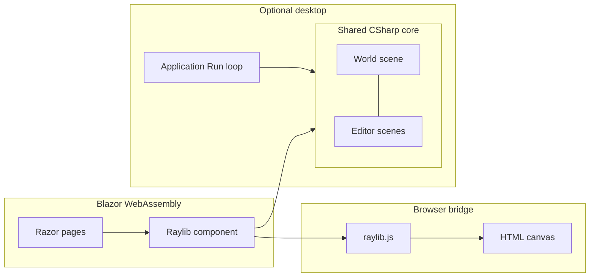

# Wolfrender - project overview

Wolfrender is a Wolfenstein-inspired, tile-based first-person experience: game logic is written in C# against **Raylib** (via Raylib-cs), and the primary shipping target is the browser as **Blazor WebAssembly**. The same core types-levels, entities, and systems-back both play mode and editing. An optional **desktop** host compiles to a native Raylib window when `CONSOLE_APP` is defined: entry point switches in [`Program.cs`](Program.cs) from the WASM host to [`Source/Core/Application.cs`](Source/Core/Application.cs), which runs the classic init/update/render loop.

This document is the high-level architecture tour. For short credits, see [README.md](README.md).

## How the pieces fit together

- **Blazor shell**: [`Program.cs`](Program.cs) builds a `WebAssemblyHost`, mounts [`App.razor`](App.razor), and registers services (see [`Services/RegisterServices.cs`](Services/RegisterServices.cs)). Routing sends `/` and `/editor` to their Razor pages.
- **Raylib on the web**: [`Components/Raylib.razor`](Components/Raylib.razor) renders a full-viewport `<canvas>`. [`Components/Raylib.razor.cs`](Components/Raylib.razor.cs) imports [`wwwroot/js/raylib.js`](wwwroot/js/raylib.js), initializes the bridge, and drives a render loop that invokes the page’s `OnRender` callback each frame (browser `requestAnimationFrame` path).
- **Native Raylib for WASM**: [`Raylib.props`](Raylib.props) wires Emscripten-oriented settings (including linking `raylib.a`, WASM native build, and exception handling). Details vary by Debug vs Release; treat this file as the source of truth for build flags.
- **Shared game core**: Pages construct [`IScene`](Source/Core/IScene.cs) implementations-[`World`](Source/Core/World.cs) for play, editor scenes for tooling-living under [`Source/Core`](Source/Core), [`Source/Engine`](Source/Engine), [`Source/Features`](Source/Features), and [`Source/Editor`](Source/Editor).

## Web app: routes and UX

### `/` - Play

[`Pages/ThreeDFirstPerson.razor`](Pages/ThreeDFirstPerson.razor) hosts the [`Raylib`](Components/Raylib.razor) canvas for the main game. [`ThreeDFirstPerson.razor.cs`](Pages/ThreeDFirstPerson.razor.cs) lists assets under `wwwroot`, preloads them into the Emscripten virtual filesystem (`Raylib.PreloadFile`), then opens the Raylib window and audio device at the browser size. The active scene is [`World`](Source/Core/World.cs).

Small **HTML overlays** sit above the canvas when toggled: **Backspace** opens an options panel (volume, mouse sensitivity, resolution downsampling) and coordinates cursor capture with the game; **`I`** toggles a debug log panel.

### `/editor` - Level editor (web UI)

[`Pages/WebEditor.razor`](Pages/WebEditor.razor) stacks Blazor **editor chrome** (`Components/Editor/*.razor`, styled with [`wwwroot/css/editor.css`](wwwroot/css/editor.css)) over the same Raylib canvas. The scene implementation is [`WebEditorScene`](Source/Editor/WebEditorScene.cs), which intentionally avoids ImGui; panels bind to [`EditorState`](Source/Editor/EditorState.cs).

## Editor: two UIs, one data model

Editors and the game share **[`MapData`](Source/Core/Level/MapData.cs)**-floor, walls, ceiling, doors grids plus enemy, pickup, and player-spawn placements-and **[`EditorState`](Source/Editor/EditorState.cs)** for tool mode, layers, camera, and simulation toggles. **[`EditorMapRenderer`](Source/Editor/EditorMapRenderer.cs)** draws the top-down map view.

| Host | Scene | UI |
|------|--------|-----|
| Desktop (`Application`) | [`LevelEditorScene`](Source/Editor/LevelEditorScene.cs) | ImGui via [`EditorGui`](Source/Editor/EditorGui.cs) / rlImGui |
| Web (`/editor`) | [`WebEditorScene`](Source/Editor/WebEditorScene.cs) | Blazor components |

On **desktop**, [`Application.Run`](Source/Core/Application.cs) uses **F1** to swap between `World` and `LevelEditorScene`. If the project defines **`EDITOR`** at compile time, startup can begin in the editor instead of the game.

On **web**, [`WebEditor.razor.cs`](Pages/WebEditor.razor.cs) uses **Q** to toggle between `WebEditorScene` and `World` so you can **play-test** the same `EnemySystem`, `DoorSystem`, and `Player` instance without leaving the editor route.

Levels load and save through **[`LevelSerializer`](Source/Editor/LevelSerializer.cs)** (JSON). The bundled level shipped with the app is [`wwwroot/resources/level.json`](wwwroot/resources/level.json); [`Application.LoadMapData`](Source/Core/Application.cs) is the shared loader used when constructing scenes.

## Game runtime: `World` and systems

[`World`](Source/Core/World.cs) implements `IScene` and is the composition root for the gameplay systems. Infrastructure systems live under [`Source/Engine`](Source/Engine) (input, movement, collision, camera, audio, rendering) and feature slices under [`Source/Features`](Source/Features) (combat, enemies, pickups, doors, players, level progress, world objects, animation, HUD). **[`RenderSystem`](Source/Engine/Rendering/RenderSystem.cs)** walks tiles in range of the player, applies a forward-facing / distance heuristic, and draws textured geometry (see also utilities such as [`PrimitiveRenderer`](Source/Engine/Rendering/PrimitiveRenderer.cs)).

For deeper behaviour while running (e.g. pause, mouse capture, minimap), see **[`InputSystem`](Source/Engine/Input/InputSystem.cs)**.

There is also an in-game **debug console**: overlay and command plumbing live under [`Source/DebugConsole`](Source/DebugConsole), with commands wired for the `World` session.

**Runtime assets** (textures, shaders, music, level JSON) live under [`wwwroot/resources`](wwwroot/resources) and are preloaded from the page code when running in WASM.

## Building and deployment

Local and CI builds align with [`.github/workflows/main.yml`](.github/workflows/main.yml):

1. Use **.NET 10** (preview quality band matches CI).
2. Install the **wasm-tools** workload: `dotnet workload install wasm-tools`.
3. Clone **[rlImGui-cs](https://github.com/raylib-extras/rlImGui-cs)** into `Library/rlImGui-cs` (see [`Library/clone-dependencies.sh`](Library/clone-dependencies.sh)); required for the desktop ImGui editor stack.
4. Publish the Blazor project (exact `.csproj` path is in the workflow, typically `Wolfrender.Blazor.Raylib.csproj` under this repo root).

The workflow publishes `wwwroot` to **GitHub Pages** and copies `index.html` to `404.html` so client-side routes like `/editor` work on static hosting. Deployment also adds `.nojekyll` and may set a **CNAME** for a custom domain-see the workflow for the current host name.

## Acknowledgments

This project builds on excellent upstream work:

- [Raylib](https://raylib.com)
- [DotnetRaylibWasm](https://github.com/stanoddly/DotnetRaylibWasm)
- [Raylib-cs](https://github.com/ChrisDill/Raylib-cs)
- [Blazor.Raylib](https://github.com/trucidare/Blazor.Raylib)
- [rlImGui-cs](https://github.com/raylib-extras/rlImGui-cs) - ImGui integration used by the desktop level editor
