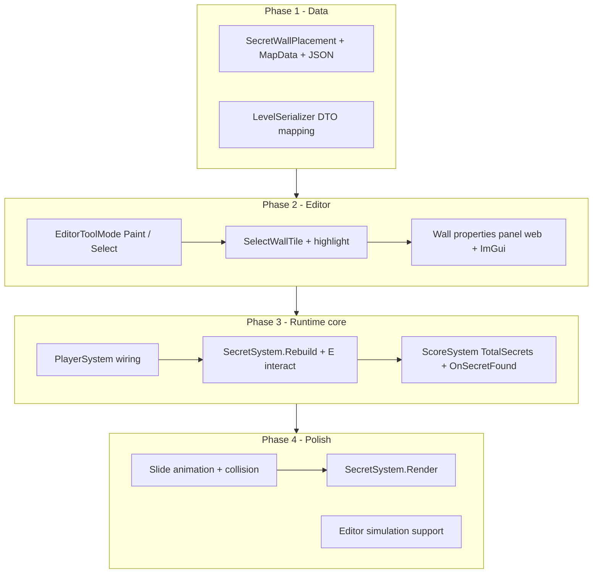

# Secret Walls

A secret is a hidden room behind a wall that slides aside when the player stands near it and presses **E**. This document is a phased implementation plan. Each phase ends with concrete acceptance checks so you can verify correctness before moving on.

---

## Key codebase facts

| Topic | Current state |
|-------|---------------|
| Walls | Flat `uint[]` on `MapData.Walls`. One sprite ID per cell; no per-wall metadata today. |
| Editor input | **Paint-only** on tile layers: LMB held calls `EditorState.PaintTile` every frame. No select mode. |
| Entity editor pattern | Enemies and pickups use click-to-place/select on dedicated layers plus properties panels (`WebEditorEnemyProperties`, `EditorGui.RenderEnemyPropertiesPanel`). |
| E key interact | `ExitSystem` (wall tile IDs 44/42) runs first and can consume interact; then `DoorSystem` opens doors within **1.5 tiles**. |
| Scoring | `ScoreSystem.OnSecretFound()` and HUD `SECRETS: X%` exist, but `TotalSecrets` is always **0** and nothing calls `OnSecretFound()`. |
| Wall movement | Doors slide via `DoorSystem.Animate`. Static walls do not move except exit art swap (44 to 42). |
| Architecture | Vertical slices under `Source/Features/`. Editor uses **two UIs, one brain** (`EditorState` shared by ImGui and Blazor). |

---

## Feature summary

### Editor

Two explicit tools on tile layers (especially **Walls**):

| Mode | LMB on map | Palette |
|------|------------|---------|
| **Paint** (current) | Drag paints `SelectedTileId` into active layer | Tile palette visible |
| **Select** (new) | Click selects a wall cell; opens properties panel | Tile palette hidden or disabled |

**Wall properties panel** fields:

- **Is secret** - checkbox; when checked, this wall cell is a secret wall at runtime
- **Travel direction** - which way the wall moves when activated (North / East / South / West)
- **Travel distance** - how many tile units the wall slides (integer, minimum 1)

When a wall is not marked secret, it has no secret metadata (or metadata is cleared on uncheck).

### Runtime

When **E** is pressed:

1. Consider only wall cells on tiles **adjacent to the player** (the 8 surrounding tiles, or the 4 cardinals if we prefer stricter Wolf3D-style adjacency - see design decisions).
2. Among those, find secret walls the player is close enough to (distance threshold, default **1.5 tiles** to match exit/door interact).
3. Activate the closest qualifying secret (one per press).
4. Wall slides in the authored direction for the authored distance, opening the passage.
5. `ScoreSystem.OnSecretFound()` fires once per secret (first activation only).

---

## Data model

Secrets need metadata beyond a wall sprite ID. Follow the **placement list** pattern used by enemies and pickups rather than encoding everything in tile IDs.

### Proposed types

New slice: `Source/Features/LevelProgress/` (alongside `ExitSystem`, `ScoreSystem`).

```
Source/Features/LevelProgress/
  SecretWallPlacement.cs       // runtime model
  SecretWallPlacementData.cs   // JSON DTO + From/To mapping
  SecretWallDirection.cs       // N, E, S, W enum
  SecretSystem.cs              // rebuild, interact, animation, scoring hook
  SecretWall.cs                // runtime instance (position, state, direction, distance)
```

```csharp
public enum SecretWallDirection { North, East, South, West }

public class SecretWallPlacement
{
    public int TileX { get; set; }
    public int TileY { get; set; }
    public SecretWallDirection Direction { get; set; }
    public int TravelTiles { get; set; } = 1;
}

public class SecretWall  // runtime, built from placement + live wall tile
{
    public int TileX { get; set; }
    public int TileY { get; set; }
    public Vector2 Position { get; set; }       // current slide position (tile space)
    public Vector2 StartPosition { get; set; }
    public SecretWallDirection Direction { get; set; }
    public int TravelTiles { get; set; }
    public uint WallTileId { get; set; }          // sprite to render while sliding
    public bool IsActivated { get; set; }
    public bool IsAnimating { get; set; }
    public SecretWallState State { get; set; }    // Idle, Sliding, Open
}
```

### MapData and JSON

Extend `MapData`:

```csharp
public List<SecretWallPlacement> SecretWalls { get; set; } = new();
```

Extend `LevelFileData` in `LevelSerializer.cs`:

```json
"SecretWalls": [
  { "TileX": 12, "TileY": 8, "Direction": "East", "TravelTiles": 2 }
]
```

**Invariant:** every `SecretWallPlacement` must reference a cell where `MapData.Walls[tile] > 0` at save time. Editor validation can warn on orphan placements.

**Is secret checkbox:** a wall is secret iff it has a matching entry in `MapData.SecretWalls` (keyed by tile coordinates). Unchecking removes the entry; checking creates or updates it.

---

## Editor mode design

### `EditorToolMode` enum

Add to `EditorState`:

```csharp
public enum EditorToolMode { Paint, Select }
public EditorToolMode ToolMode = EditorToolMode.Paint;
```

Toggle via:

- Toolbar buttons in `EditorGui` and web menu bar
- Hotkey suggestion: **B** for brush/paint, **S** for select (verify no conflict with existing binds)

### Input changes

In `LevelEditorScene.HandleTileAndEnemyInput` and `WebEditorScene.HandleTileAndEnemyInput`:

| Condition | Behavior |
|-----------|----------|
| Tile layer + **Paint** + LMB down | Current `PaintTile` drag behavior |
| Tile layer + **Select** + LMB pressed (once) | If `GetWallTileAt(x,y) > 0`, call `SelectWallTile(x,y)`; else clear wall selection |
| Enemy / pickup layers | Unchanged (always entity placement/select) |

Select mode must **not** call `PaintTile` on click or drag.

### Selection state

Add to `EditorState`:

```csharp
public int SelectedWallTileX = -1;
public int SelectedWallTileY = -1;
public bool HasSelectedWall => SelectedWallTileX >= 0;

public void SelectWallTile(int x, int y);
public void ClearWallSelection();
public SecretWallPlacement? GetSelectedSecretPlacement();  // null if wall not secret
public void SetWallSecret(bool isSecret, SecretWallDirection dir, int travelTiles);
```

Highlight selected wall in `EditorMapRenderer` (reuse tile highlight color pattern from enemy selection).

### Properties panels

Follow the enemy/pickup dual-UI pattern:

| UI | File |
|----|------|
| Web | `Components/Editor/Walls/WebEditorWallProperties.razor` |
| Desktop | `EditorGui.RenderWallPropertiesPanel` |

Panel visible when `ToolMode == Select`, `HasSelectedWall`, and Walls layer (or any tile layer with a wall at selection - prefer **Walls layer only** for v1).

Fields:

- Checkbox **Secret wall**
- Direction dropdown (N/E/S/W), enabled when secret checked
- Travel tiles number input (min 1, max map bounds), enabled when secret checked
- Read-only: tile coords, wall sprite ID
- Optional: arrow overlay preview in map renderer showing slide path

Wire into `WebEditor.razor` with `@bind-ShowWallProperties` on menu bar (mirror enemy properties).

---

## Runtime design

### `SecretSystem`

Responsibilities:

1. **`Rebuild(MapData)`** - scan `MapData.SecretWalls`, validate wall exists, build runtime `SecretWall` list; skip already-activated secrets on reload if we persist activation (v1: reset on level load).
2. **`Update(deltaTime, input, player)`** - on E, try activate; animate sliding walls; return **bool consumed interact** (same contract as `ExitSystem`).
3. **Render** - draw sliding wall geometry at interpolated `Position` (mirror `DoorSystem.Render` placement math).
4. **Collision** - implement `IMovementBlocker` or update `MapData.Walls` as the wall moves so the opening becomes walkable.

### E key / proximity algorithm

```csharp
// 1. Player tile (float, same as ExitSystem / DoorSystem)
var playerTile = new Vector2(px, py);

// 2. Adjacent tile candidates (8-way around player tile floor coords)
foreach (var (tx, ty) in TilesAroundPlayer(playerTile))
{
    var secret = FindSecretAt(tx, ty);
    if (secret == null || secret.IsActivated) continue;

    var secretCenter = new Vector2(secret.TileX, secret.TileY);
    if (Vector2.Distance(playerTile, secretCenter) > InteractRadiusTiles) continue;

    // collect candidates
}

// 3. Activate closest candidate
```

Constants:

- `InteractRadiusTiles = 1.5f` (match `ExitTileIds.InteractRadiusTiles` and doors)
- `SlideSpeedTilesPerSecond = 1.0f` (match door slide speed unless tuned)

### Scoring integration

In `ScoreSystem.ResetForLevel(MapData mapData)`:

```csharp
TotalSecrets = mapData.SecretWalls.Count;
SecretsFound = 0;
```

On first activation in `SecretSystem`:

```csharp
if (!secret.HasScored)
{
    secret.HasScored = true;
    _scoreSystem.OnSecretFound();
}
```

HUD should then show `SECRETS: 50% (1/2)` etc. Completion bonus already checks `SecretsFound >= TotalSecrets` in `ComputeCompletionBonuses()`.

### `PlayerSystem` wiring

Extend the interact chain in `PlayerSystem.UpdateAlive`:

```
ExitSystem.Update          -> may consume E
SecretSystem.Update        -> may consume E (use input.WithoutInteract() for doors if consumed)
DoorSystem.Update
```

Order rationale: exit and secrets are level-progress interactions; doors remain fallback.

### Wall slide / map mutation

While sliding, each frame:

1. Interpolate `Position` toward `StartPosition + Direction * TravelTiles`.
2. Clear `MapData.Walls` at the tile the wall vacated; set wall at the tile it occupies (or use a runtime-only blocker list until slide completes, then commit final wall positions).

**v1 simplification (Phase 3):** instant teleport - remove wall at start, optionally place wall at end tile. Validates interact + scoring before animation work.

**v2 (Phase 4):** smooth slide like doors; collision opens as soon as the wall leaves a tile.

---

## Architecture diagram



---

## Phase breakdown

### Phase 1: Data model and serialization

| Step | Work |
|------|------|
| 1a | Add `SecretWallDirection`, `SecretWallPlacement`, `SecretWallPlacementData` |
| 1b | Add `MapData.SecretWalls` list |
| 1c | Extend `LevelFileData` serialize/deserialize in `LevelSerializer.cs` |
| 1d | Manual JSON round-trip test (save level, reload, list preserved) |

**Done when:**

- A level JSON with a `SecretWalls` array loads without error.
- Saving writes the array back unchanged.
- Empty or missing `SecretWalls` defaults to an empty list (backward compatible).

**Verify:**

1. Add a test entry by hand in a level JSON.
2. Load in editor, save, diff JSON - entry unchanged.
3. Load an old level with no `SecretWalls` key - no crash.

---

### Phase 2: Editor select mode and wall properties

| Step | Work |
|------|------|
| 2a | Add `EditorToolMode`, toggle UI, status bar hint |
| 2b | Branch input in `LevelEditorScene` and `WebEditorScene` (select vs paint) |
| 2c | `SelectWallTile`, selection highlight in `EditorMapRenderer` |
| 2d | `SetWallSecret` helpers mutating `MapData.SecretWalls` |
| 2e | `WebEditorWallProperties.razor` + `EditorGui.RenderWallPropertiesPanel` |
| 2f | Optional: direction arrow preview overlay on selected secret |

**Done when:**

- On Walls layer, **Paint** mode behaves exactly as today.
- **Select** mode: click a wall cell opens properties; click empty clears selection; drag does not paint.
- Checking **Secret wall** adds a placement; unchecking removes it.
- Direction and travel tiles persist across save/load.
- Both web editor and desktop ImGui editor expose the same fields.

**Verify:**

1. Paint a wall, switch to Select, click it - panel shows sprite ID and secret unchecked.
2. Enable secret, set East / 2 tiles, save, reload - values restored.
3. Select mode: LMB drag across map does not change tiles.
4. Uncheck secret, save - `SecretWalls` entry gone from JSON.

---

### Phase 3: Runtime discovery, interact, and scoring

| Step | Work |
|------|------|
| 3a | Add `SecretSystem` with `Rebuild`, adjacent-tile + distance check, instant activation |
| 3b | Wire into `World` constructor; call `Rebuild` on level load |
| 3c | Hook `PlayerSystem` after `ExitSystem`, before doors |
| 3d | `ScoreSystem.ResetForLevel` sets `TotalSecrets` from `mapData.SecretWalls.Count` |
| 3e | Call `OnSecretFound()` on first activation |
| 3f | Instant activation: clear start wall tile; optionally write wall at end position |

**Done when:**

- Play mode: standing next to a authored secret and pressing **E** activates it (wall opens).
- Pressing **E** again does not re-score.
- HUD shows correct `SECRETS: found/total`.
- Exit interact still works and takes priority over secrets on the same frame.
- Secrets more than 1.5 tiles away do not activate.
- Secrets on non-adjacent tiles do not activate even if within radius (adjacency gate).

**Verify:**

1. Level with 2 secrets - activate both; HUD `100% (2/2)`.
2. Stand 2 tiles away facing secret - E does nothing.
3. Stand adjacent but not within 1.5 tile distance to center - E does nothing (edge case at corners).
4. Complete level exit - completion bonus includes secrets perfect bonus when all found.

**Not in scope yet:** smooth animation, editor simulation scoring.

---

### Phase 4: Slide animation, collision, and rendering

| Step | Work |
|------|------|
| 4a | `SecretWall` runtime state machine: Idle, Sliding, Open |
| 4b | Animate position at door-like speed; render wall mesh at slide position |
| 4c | Update collision as tiles are vacated (implement `IMovementBlocker` or live wall array updates) |
| 4d | Editor simulation: call `SecretSystem.Update` during `EditorState.IsSimulating` (mirror door sim hook) |

**Done when:**

- Activated secret wall visibly slides authored distance over time.
- Player can walk through the opening once the wall has cleared each tile.
- Sliding wall still blocks movement until it leaves a tile.
- Editor simulation (P) allows E to trigger secrets for layout testing.

**Verify:**

1. Travel 2 tiles East - player cannot pass until slide completes; then can enter hidden area.
2. Block slide path with another wall - define behavior (stop at obstruction vs clip); document chosen rule.
3. Toggle sim in editor, trigger secret, confirm motion without full `World` play mode.

---

### Phase 5: Polish and edge cases (optional follow-up)

| Step | Work |
|------|------|
| 5a | SFX / HUD hint ("Secret wall" prompt when adjacent, like door locked hint) |
| 5b | Delete key clears secret metadata when wall tile erased in paint mode |
| 5c | Validation: warn if secret placement has no wall tile |
| 5d | Web editor tool mode toggle if not done in Phase 2 |

---

## Manual test matrix

| Scenario | Expected |
|----------|----------|
| Old level, no `SecretWalls` key | Loads; `TotalSecrets = 0`; HUD shows 100% (0/0) |
| Editor paint mode | Unchanged from current behavior |
| Editor select mode, click wall | Properties panel opens |
| Editor select mode, click floor | Selection cleared |
| Mark secret + save/load | JSON round-trip |
| Play: adjacent + within 1.5 tiles + E | Secret activates, score increments |
| Play: same secret + E again | No duplicate score |
| Play: two secrets | Each scores once; HUD reaches 100% |
| Play: exit tile nearby | Exit consumes E first |
| Play: slide 2 tiles | Hidden room reachable after animation |
| Sim mode in editor | E triggers secret slide (Phase 4) |

Suggested test level: single room with one secret wall on the north side, `TravelTiles = 1`, empty walkable space behind it. Second room optional for multi-secret HUD test.

---

## Files to touch (by phase)

### Phase 1

| File | Change |
|------|--------|
| `Source/Features/LevelProgress/SecretWallDirection.cs` | **New** |
| `Source/Features/LevelProgress/SecretWallPlacement.cs` | **New** |
| `Source/Features/LevelProgress/SecretWallPlacementData.cs` | **New** |
| `Source/Core/Level/MapData.cs` | `SecretWalls` list |
| `Source/Core/Level/LevelSerializer.cs` | DTO + mapping |

### Phase 2

| File | Change |
|------|--------|
| `Source/Editor/EditorState.cs` | Tool mode, selection, secret helpers |
| `Source/Editor/LevelEditorScene.cs` | Input branch |
| `Source/Editor/WebEditorScene.cs` | Input branch |
| `Source/Editor/EditorMapRenderer.cs` | Selection + direction preview |
| `Source/Editor/EditorGui.cs` | Mode toggle + wall properties panel |
| `Components/Editor/Walls/WebEditorWallProperties.razor` | **New** |
| `Pages/WebEditor.razor` | Panel visibility |
| `Components/Editor/Shared/WebEditorMenuBar.razor` | Tool mode + show wall properties |

### Phase 3

| File | Change |
|------|--------|
| `Source/Features/LevelProgress/SecretSystem.cs` | **New** |
| `Source/Features/LevelProgress/ScoreSystem.cs` | `TotalSecrets` from map |
| `Source/Features/Players/PlayerSystem.cs` | Interact chain |
| `Source/Core/World.cs` | Construct + rebuild + update |

### Phase 4

| File | Change |
|------|--------|
| `Source/Features/LevelProgress/SecretWall.cs` | **New** runtime instance |
| `Source/Features/LevelProgress/SecretSystem.cs` | Animate, render, collision |
| `Source/Editor/EditorState.cs` | Sim hook for secrets |
| `Source/Engine/Movement/CollisionSystem.cs` | Optional blocker integration |

---

## Design decisions

1. **Placement list vs tile IDs** - Use `List<SecretWallPlacement>` for direction and distance. Exit-style tile IDs alone cannot express travel distance cleanly.
2. **Adjacent-tile gate** - Only secrets on tiles surrounding the player are candidates; distance threshold applies among those. This matches "stand close to the wall" and avoids activating secrets through thin walls at range. Default neighborhood: **8 adjacent tiles** (including diagonals). Switch to 4 cardinals only if diagonal activation feels wrong in playtest.
3. **Interact radius** - **1.5 tiles**, consistent with `ExitSystem` and `DoorSystem`.
4. **One activation per E press** - Closest qualifying secret wins; same frame as exit/door consume rules.
5. **Scoring** - Count authored secrets in `ResetForLevel`; increment only on first activation. Re-loading level resets found state.
6. **Instant vs animated** - Phase 3 ships instant open to validate data, editor, interact, and scoring. Phase 4 adds slide animation and collision.
7. **Wall erased in paint mode** - Orphan `SecretWallPlacement` entries should be cleaned when the wall tile is cleared (Phase 5 or small Phase 2 add-on).

---

## Suggested implementation order

1. Phase 1 - land data + JSON first; no UI or runtime.
2. Phase 2 - editor can author secrets; verify save/load before any gameplay code.
3. Phase 3 - runtime interact + scoring with instant open; playtest adjacency and HUD.
4. Phase 4 - animation and collision; playtest hidden room traversal.
5. Phase 5 - polish as needed.

Do not wire `World` until Phase 3. Do not animate until scoring and adjacency rules pass in Phase 3.
