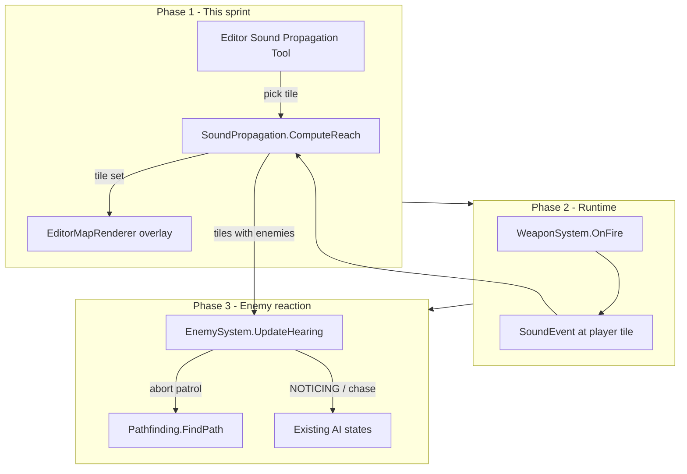

# Sound Propagation

When the player fires a gun, enemies on tiles reached by sound should hear it, abort patrol, and path toward the player. This document covers the phased implementation plan. Phase 1 delivers the propagation algorithm and an editor debug tool before wiring gameplay.

---

## Key codebase facts

| Topic | Current state |
|-------|---------------|
| Rooms | No authored room data. A "room" is an **implicit connected region** of walkable tiles bounded by walls and closed doors. |
| Walls | `MapData.Walls[tile] > 0` = solid (same as `Pathfinding` / `CollisionSystem`). |
| Doors | Runtime `Door` entities in `DoorSystem.Doors`; map layer in `MapData.Doors`. States: `CLOSED`, `OPENING`, `OPEN`, `CLOSING`. |
| Pathfinding precedent | `Pathfinding.IsTileBlocked` blocks doors when `DoorState != OPEN` (so **OPENING and CLOSING are blocked** for A*). Sound uses a **different rule**: only `CLOSED` blocks. |
| Editor tool precedent | **Pathfinding Visualizer** - `EditorState` fields, `EditorGui.RenderPathfindingPanel`, `EditorMapRenderer.DrawPathPreview`, tile pick mode in `LevelEditorScene`. |
| Simulation | `EditorState.IsSimulating` drives live door animation via `DoorSystem.Update`. Doors rebuild to all `CLOSED` when simulation **starts**, not when it stops. |

---

## Algorithm design (Phase 1a)

### Approach: BFS flood-fill on walkable tiles

Sound does not need raycasting (unlike line-of-sight). It spreads tile-to-tile through open floor space, stopping at walls and closed doors - matching "all tiles within a room" plus spill into adjacent rooms through non-closed doors.

```
Origin tile
    |
    v
BFS queue of (x, y)
    |
    +-- Skip if OOB, already visited, or tile is not a propagation cell
    |
    +-- Enqueue 4-neighbors (N/E/S/W) if the step is not blocked
```

### Tile is a propagation cell when

- Not out of bounds
- `MapData.Walls[x,y] == 0`
- Same object blocking rule as pathfinding (`ObjectSprites.BlocksMovement`) so pillars block sound the same way movement does

### Step from tile A to neighbor B is blocked when

- Neighbor B fails the propagation cell check, **or**
- Crossing involves a **closed** door on either tile

### Door passability

Sound propagation uses a simpler rule than pathfinding or line-of-sight. **Only `CLOSED` doors block sound.**

| Door state | Sound passes? |
|------------|---------------|
| `OPEN` | Yes |
| `OPENING` | Yes |
| `CLOSING` | Yes |
| `CLOSED` | No |

### Door lookup helper

Reuse the same tile-matching pattern as `Pathfinding.IsTileBlocked` - match `door.StartPosition` rounded to tile coords. Add `SoundPropagation.IsDoorBlockingSound(Door)` (returns true only when `DoorState == CLOSED`).

### Simulation vs edit mode

| Mode | Door list source |
|------|------------------|
| Simulating | `DoorSystem.Doors` (live door states) |
| Not simulating | Treat all doors as **closed** - call `DoorSystem.Rebuild(MapData.Doors, MapData.Width)` before compute, or pass a flag that forces `CLOSED` for every door regardless of stale runtime state |

The stale-state issue matters: after stopping simulation, doors may still be `OPEN` in memory. Non-sim tests should always assume authored default (all closed).

### Proposed API

New feature slice:

```
Source/Features/SoundPropagation/
  SoundPropagation.cs          // static pure algorithm (editor + runtime share this)
  SoundPropagationResult.cs    // optional wrapper: HashSet<(int x,int y)> or List<Vector2>
```

```csharp
public static HashSet<(int X, int Y)> ComputeReach(
    MapData map,
    IReadOnlyList<Door> doors,
    int originX, int originY,
    bool treatAllDoorsClosed = false);
```

- Returns every tile sound reaches (including origin if valid)
- Returns empty set if origin is inside a wall
- No max radius in v1 - entire connected component is heard (tunable later via `maxTiles` or `maxDistance`)

### Why not reuse `LineOfSight.CastRay`

LOS is per-ray and models partial door segments during `OPENING`. Sound propagation is **omnidirectional flood-fill** through walkable space. BFS is simpler, cheaper, and matches "all tiles in the room."

---

## Editor tool (Phase 1b)

Mirror the Pathfinding Visualizer pattern.

### 1. `EditorState` additions

```csharp
// Sound propagation visualizer
public bool SoundPropagationPicking;
public List<Vector2>? SoundPropagationTiles;
public float SoundPropagationShowUntil;   // Raylib GetTime() deadline
public const float SoundPropagationDurationSeconds = 2f;
```

Methods:

- `StartSoundPropagationPick()` - sets picking mode
- `RunSoundPropagationTest(int tileX, int tileY)` - runs algorithm, stores result, sets `ShowUntil = GetTime() + 2`
- `TickSoundPropagationOverlay(float now)` - clears result when expired
- `CancelSoundPropagationPick()`

### 2. `EditorGui` - Window menu + panel

In `RenderMenuBar` Window menu (alongside Pathfinding Visualizer):

```
Window -> Sound Propagation
```

Panel (`RenderSoundPropagationPanel`):

- Status line: Ready / "Click a tile to test propagation (Esc: cancel)"
- **Test at tile** button - enters pick mode
- Tile count label after run: `"Reached 47 tiles"`
- **Clear** button
- Note when simulating: `"Using live door states"`

Desktop-only for Phase 1 is acceptable (Pathfinding Visualizer is desktop-only today). Web parity can be a small follow-up.

### 3. Input wiring - `LevelEditorScene`

Extend the existing pick-mode chain (alongside pathfinding pick mode):

- Add `SoundPropagationPicking` branch (same LMB tile pick, Esc cancel, `_suppressMapClickUntilRelease` latch)
- In `Update`: call `_state.TickSoundPropagationOverlay(GetTime())`

### 4. Overlay rendering - `EditorMapRenderer`

New method `DrawSoundPropagationOverlay(List<Vector2>? tiles, EditorCamera camera)`:

- Reuse `FillTile` from path preview
- Color: e.g. orange/amber `(255, 160, 40, 140)` - distinct from green/red path endpoints
- Draw **after** map layers, **before** tile highlight
- Hard clear at 2s is fine for v1; optional alpha fade in v1.1

Call site in `LevelEditorScene.Render()` next to `DrawPathPreview`.

### 5. On-screen hint banner

Same pattern as pathfinding pick banner:

```
TEST SOUND PROPAGATION - LMB: Set origin | Esc: Cancel
```

---

## Architecture diagram



---

## Phase breakdown

### Phase 1 (now): Algorithm + editor tool

| Step | Work |
|------|------|
| 1a | `Source/Features/SoundPropagation/SoundPropagation.cs` - BFS + door rules + unit-testable pure function |
| 1b | `EditorState` fields and methods |
| 1c | `EditorGui` Window menu item + panel |
| 1d | `LevelEditorScene` pick input, timer tick, render overlay |
| 1e | Manual test matrix (below) |

**Done when:** You can open Window -> Sound Propagation, click Test, pick a tile, see colored tiles for 2 seconds, in both sim and non-sim modes with correct door behavior.

### Phase 2: Runtime emission

- Emit from `WeaponSystem` on player fire (tile from player world position / `QuadSize`)
- Optional: enemy shots, door slams later
- `World` wiring if a system wrapper is needed; keep compute logic in `SoundPropagation.cs`

### Phase 3: Enemy hearing + patrol abort

- Add `LastHeardPosition` (or reuse `LastSeenPlayerPosition` with a `HeardPlayer` flag) on `Enemy`
- Throttled check: enemies whose tile is in the reach set react
- Abort patrol: clear patrol waypoint index, transition to chase (mirror LOS break -> `ComputePathToTarget` flow in `EnemySystem`)
- No new level JSON fields in v1 unless per-enemy hearing range is needed later

---

## Manual test matrix (Phase 1 acceptance)

| Scenario | Expected |
|----------|----------|
| Origin in open room | All floor tiles in that room highlighted; walls not highlighted |
| Closed door to adjacent room | Propagation stops at door tile; other room not reached |
| Sim: door opened (E) | Propagation crosses into next room |
| Sim: door mid-OPENING | Propagation crosses |
| Sim: door CLOSING | Propagation still crosses (only CLOSED blocks) |
| Origin on wall tile | Empty result or status message "invalid origin" |
| Re-test before 2s expires | Overlay replaces with new result; timer resets |
| Non-sim after prior sim with open doors | All doors treated closed; adjacent rooms not connected |

Suggested test level: one room with a door to a second room; start sim, open door, run tool from room 1 - should reach room 2. Stop sim, run again - should not.

---

## Files to touch (Phase 1)

| File | Change |
|------|--------|
| `Source/Features/SoundPropagation/SoundPropagation.cs` | **New** - core algorithm |
| `Source/Editor/EditorState.cs` | Pick mode, result, timer, `RunSoundPropagationTest` |
| `Source/Editor/EditorGui.cs` | Menu item + panel |
| `Source/Editor/EditorMapRenderer.cs` | `DrawSoundPropagationOverlay` |
| `Source/Editor/LevelEditorScene.cs` | Input, update tick, render call, banner |

No `World.cs` changes until Phase 2. No serializer changes.

---

## Design decisions

1. **4-way BFS** - Cardinal neighbors only. Sound through diagonal wall corners feels wrong; matches corridor topology better.
2. **Objects layer** - Block propagation when `BlocksMovement` (consistent with pathfinding).
3. **Door tile as propagation cell** - Include when the door is not closed. Origin on a closed door tile is an edge case - skip or allow only if the door is not closed.
4. **Web editor** - Defer unless parity is needed immediately; desktop ImGui first matches Pathfinding Visualizer scope.

---

## Suggested implementation order

1. Implement `SoundPropagation.ComputeReach` with a sanity check (pick one known level, log tile count).
2. Wire editor state + panel + pick flow without overlay - log tile count to status bar.
3. Add overlay rendering + 2s timer.
4. Run the test matrix with a door-heavy level.
5. Only then start Phase 2 (weapon hook) and Phase 3 (enemy AI).
